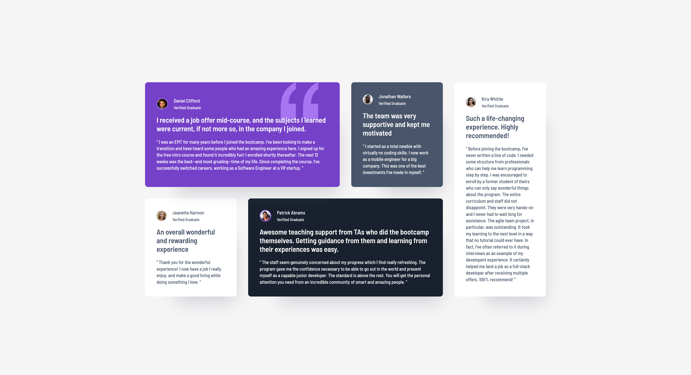
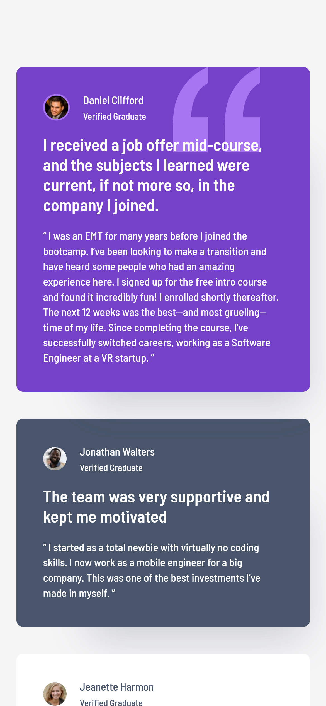

## Project Overview

This project builds a responsive **Testimonials Grid Section** using CSS Grid, based on a design provided by Frontend Mentor. It focuses on mastering CSS Grid layout techniques while maintaining semantic HTML structure, SCSS architecture, and design fidelity.

- Responsive, mobile-first layout using CSS Grid and media queries
- Semantic HTML and scalable SCSS architecture
- High-fidelity implementation based on the Figma prototype
- First-principles approach to CSS Grid to deepen layout mastery
- [Link to Frontend Mentor Challenge](https://www.frontendmentor.io/challenges/testimonials-grid-section-Nnw6J7Un7)

## Technologies Used

- HTML5
- CSS3 (CSS Grid, Media Queries)
- SCSS (Variables, Mixins, Nesting, Partials) – [SASS Docs](https://sass-lang.com/documentation)
- Bootstrap (for optional utility classes or rapid prototyping) – [Bootstrap Docs](https://getbootstrap.com/docs/5.3/getting-started/introduction/)

## Screenshots

| Desktop View                                                              | Mobile View                                                             |
| ------------------------------------------------------------------------- | ----------------------------------------------------------------------- |
|  |  |

> 📸 _Screenshots to be added after initial build and polish_

## Folder Structure

testimonials-grid-section/ ├── index.html # Main HTML file ├── style.css # Compiled CSS output ├── src/ │ └── styles/ # SCSS source files (partials + main.scss) ├── assets/ │ ├── images/ # Optimized project images (e.g., avatars) │ └── screenshots/ # Final project screenshots (desktop, mobile) ├── README.md └── style-guide.md # Provided by Frontend Mentor

## Getting Started

1. Clone the repository:
   `git clone https://github.com/yourusername/testimonials-grid-section.git`

2. Navigate to the project directory:
   `cd testimonials-grid-section`

3. Compile SCSS to CSS (if using the CLI):
   `sass src/styles/main.scss style.css`

4. Open `index.html` in your browser to view the layout.

## Key Learning Objectives

- Build a **grid-based responsive layout** from scratch
- Understand the difference between **explicit and implicit grid tracks**
- Practice **auto-placement**, `grid-template-areas`, and **responsive layouts with media queries**
- Improve eye for spacing, alignment, and hierarchy using Figma tools

## Improvements for the Future

- Add animations/transitions for testimonial cards on hover
- Consider refactoring the testimonial grid into a dynamic template (e.g., using a JS array)
- Optimize accessibility (ARIA labels, focus states, contrast testing)

## Time Estimation

- Initial Setup (Repo + SCSS Scaffolding): ~30 mins
- Mobile-first Layout Build: ~2–3 hours
- Desktop Grid Layout & Responsiveness: ~3–4 hours
- Pixel-Perfect Polish & QA: ~1–2 hours
- Total Estimated Time: ~6–9 hours

---

This project is part of an ongoing learning journey focused on mastering frontend fundamentals and real-world layout challenges. 🎯
